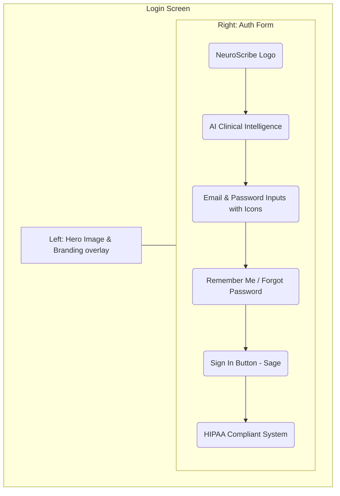
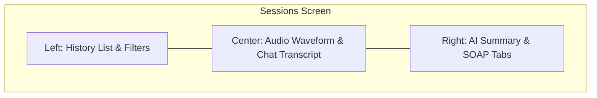
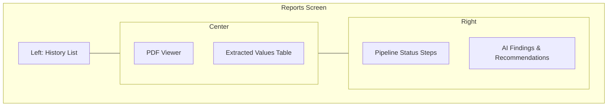
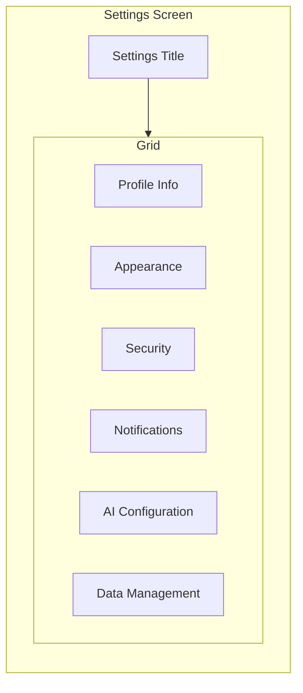

# UI Layout Reconciliation

This document reconciles the authoritative visual screenshots (Priority 1) with the **Clinical Sage** design system tokens (Priority 2) and evaluates the gap against the current implementation.

## 1. Login Page
**Approved Layout (from image):** Split-screen design. Left side features an image with overlaid "Elevating clinical clarity" text. Right side features the NeuroScribe logo, Email/Password inputs with icons, Remember me, Forgot password, Sage Green "Sign In" button, and HIPAA compliance footer.



*   **Existing Implementation:** Centered white card on plain background. No split screen.
*   **Missing Components:** Split-screen layout wrapper, Background image asset, Input icons (mail/lock), Remember me checkbox, Forgot password link, Footer text.
*   **Components to Rebuild:** `LoginPage` layout must be entirely replaced. `Input` and `Button` need `8px` Sage styling.
*   **Estimated Completion:** 20%

---

## 2. Dashboard (Patient Directory)
**Approved Layout (from image):** Global sidebar on the left. Top header with title and search. Below header, 3 KPI cards (Stable, Monitor, Attention). Below KPIs, filter tabs. Below tabs, a large data table of patients.

```mermaid
flowchart LR
    subgraph Dashboard Screen
        direction LR
        Sidebar[Sidebar: Global Nav]
        subgraph Main Area
            direction TB
            Header[Header: Title, Search, User Auth]
            subgraph KPIs
                direction LR
                K1[KPI: Stable Patients]
                K2[KPI: Monitor Patients]
                K3[KPI: Attention Required]
            end
            Tabs[Filter Tabs: All, Stable, Monitor...]
            Table[Patient Data Table]
            Header --> KPIs --> Tabs --> Table
        end
        Sidebar --- Main Area
    end
```

*   **Existing Implementation:** "Clinical Workspace" dashboard using a 2-column masonry grid (Recent Patients, Sessions, Pending Reports).
*   **Missing Components:** Global Sidebar, KPI Summary Cards, Tab Navigation component, full Data Table component.
*   **Components to Rebuild:** `DashboardPage` must be entirely scrapped and replaced with the `Patient Directory` table view.
*   **Estimated Completion:** 15%

---

## 3. Patient Overview / Workspace
**Approved Layout (from image):** Complex data dashboard. Left/Center columns contain Clinical Summary, Key Findings, Abnormalities (red pills), and Recommendations. Right column contains AI Transparency radar/score and Last Activity vertical timeline. Embedded "Ask NeuroScribe" chat floating in the corner.

```mermaid
flowchart LR
    subgraph Patient Overview
        direction LR
        Sidebar[Sidebar]
        subgraph Main Workspace
            direction TB
            Header[Patient Header: Name, MRN, Buttons]
            Nav[Tabs: Overview, Reports, Clinical Trends, Sessions]
            subgraph Content Grid
                direction LR
                subgraph Left/Center Column
                    direction TB
                    Summary[Clinical Intelligence Summary]
                    Grid[Grid: Key Findings & Abnormalities]
                    Recs[Recommendations List]
                end
                subgraph Right Column
                    direction TB
                    AI[AI Transparency & Score]
                    Activity[Last Activity Timeline]
                end
            end
            Chat[Floating Ask NeuroScribe Chat Widget]
        end
        Sidebar --- Main Workspace
    end
```

*   **Existing Implementation:** Basic tabbed interface rendering distinct pages. No unified complex grid overview. Ask NeuroScribe is a dedicated full-page tab.
*   **Missing Components:** `ClinicalSummary` card, `AbnormalitiesGrid`, `AITransparencyCard`, `FloatingChatWidget`.
*   **Components to Rebuild:** `PatientOverviewTab` layout needs a complete CSS Grid restructuring.
*   **Estimated Completion:** 25%

---

## 4. Clinical Trends (Timeline)
**Approved Layout (from image):** Top features 3 KPI cards for specific biomarkers (Hemoglobin, WBC, Platelets). Middle area splits into "AI Synthesis" (left text bullets) and "Longitudinal View" (right line chart). Bottom is a "Comparison Analysis" data table.

```mermaid
flowchart LR
    subgraph Trends Screen
        direction TB
        Header[Patient Header & Date Filter]
        subgraph Top KPIs
            direction LR
            K1[Hemoglobin]
            K2[WBC Count]
            K3[Platelets]
        end
        subgraph Middle Section
            direction LR
            AISynth[AI Synthesis Bullets]
            Chart[Longitudinal Line Chart]
        end
        Table[Comparison Analysis Table]
        Header --> Top KPIs --> Middle Section --> Table
    end
```

*   **Existing Implementation:** Vertical text-based timeline.
*   **Missing Components:** Line Chart component (requires `recharts`), Biomarker KPI cards, Comparison Data Table.
*   **Components to Rebuild:** `TimelineTab` must be renamed to `TrendsTab` and entirely rebuilt as a data visualization dashboard.
*   **Estimated Completion:** 10%

---

## 5. Sessions
**Approved Layout (from image):** 3-Column layout. Col 1: History list. Col 2: Live Audio waveform and Live Transcript chat bubbles. Col 3: AI Generated Summary broken into Subjective, Objective, Assessment, Plan tabs.



*   **Existing Implementation:** Dual-pane layout without chat-bubble styling or 4-tab SOAP structure.
*   **Missing Components:** 3-column wrapper, Chat bubble components, Audio Waveform visualizer, SOAP nested tabs.
*   **Components to Rebuild:** `SessionDetail` and `SessionWorkspace`.
*   **Estimated Completion:** 30%

---

## 6. Reports
**Approved Layout (from image):** 3-Column layout. Col 1: History list. Col 2: Document Viewer + Extracted Values Table below it. Col 3: Pipeline Status checklist + AI Findings.



*   **Existing Implementation:** 2-Column layout. Missing history and pipeline status.
*   **Missing Components:** Pipeline Status stepper, 3-column layout wrapper.
*   **Components to Rebuild:** `ReportsTab` layout.
*   **Estimated Completion:** 40%

---

## 7. Settings
**Approved Layout (from image):** Card-based grid.



*   **Existing Implementation:** Vertical stack of cards.
*   **Missing Components:** Masonry/Grid wrapper.
*   **Components to Rebuild:** `SettingsPage` layout from flex-col to grid.
*   **Estimated Completion:** 70%
