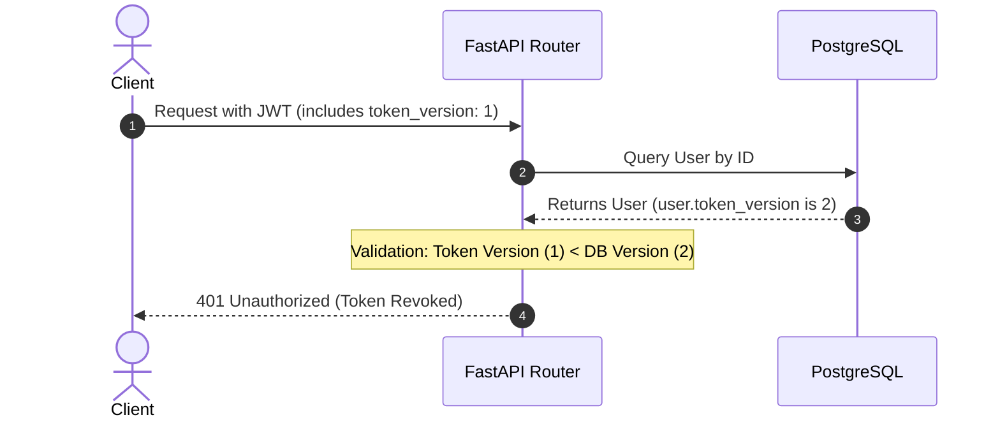

# Authentication Security Hardening Audit

This audit document evaluates the authentication system of the NeuroScribe repository, focusing on key security vulnerabilities, configuration gaps, and design architectures for advanced hardening.

---

## 1. Executive Summary & Risk Classifications

Based on an inspection of [auth_utils.py](file:///c:/Users/Manish/AI-Projects/neuroscribe/backend/auth_utils.py), [models.py](file:///c:/Users/Manish/AI-Projects/neuroscribe/backend/models.py), and [auth.py](file:///c:/Users/Manish/AI-Projects/neuroscribe/backend/routers/auth.py), the following risks have been identified:

| ID | Vulnerability / Gaps | Impact | Likelihood | Risk Level |
| :--- | :--- | :--- | :--- | :--- |
| **SEC-01** | Missing Startup Validation for `JWT_SECRET` | Critical | Low | **Medium** |
| **SEC-02** | Implicit/Unvalidated JWT Algorithm Config | High | Low | **Medium** |
| **SEC-03** | `force_password_reset` Flag Enforced in Schema but Not in Code | High | High | **High** |
| **SEC-04** | Default `HTTPBearer` Implicit Exception Raising | Medium | Medium | **Low** |
| **SEC-05** | Lack of Token Revocation Architecture | High | Medium | **High** |
| **SEC-06** | Absence of Structured Security Audit Logging | Medium | High | **Medium** |

---

## 2. Security Audits & Technical Findings

### SEC-01: Missing Startup Validation for `JWT_SECRET`
* **Finding**: [auth_utils.py](file:///c:/Users/Manish/AI-Projects/neuroscribe/backend/auth_utils.py#L15) retrieves `JWT_SECRET` via `os.getenv("JWT_SECRET")`. If this environment variable is missing, the application starts up normally. However, any subsequent call to `jwt.encode` or `jwt.decode` will fail with exceptions, or worse, use `None` as the cryptographic key (which Python's `jose` module blocks but can lead to internal server errors).
* **Remediation**: Add a validation check during initialization to throw a `RuntimeError` immediately if `JWT_SECRET` is unset.

### SEC-02: Implicit/Unvalidated JWT Algorithm Configuration
* **Finding**: [auth_utils.py](file:///c:/Users/Manish/AI-Projects/neuroscribe/backend/auth_utils.py#L16) loads `JWT_ALGORITHM` with a default value of `"HS256"`. It does not restrict this parameter to a safe whitelist. An administrator or attacker able to manipulate environmental configurations could change this to `"none"` or asymmetric types, potentially introducing signature bypass vulnerabilities depending on library-level parsing.
* **Remediation**: Check and whitelist algorithm values, permitting only `"HS256"` during initialization.

### SEC-03: `force_password_reset` Flag is Not Enforced
* **Finding**: While [models.py](file:///c:/Users/Manish/AI-Projects/neuroscribe/backend/models.py#L104) defines `force_password_reset = Column(Boolean, default=False, nullable=False)`, the flag is never checked in [auth.py](file:///c:/Users/Manish/AI-Projects/neuroscribe/backend/routers/auth.py#L74) during login or in [auth_utils.py](file:///c:/Users/Manish/AI-Projects/neuroscribe/backend/auth_utils.py#L61) inside `get_current_user`. 
* **Impact**: A user with `force_password_reset = True` can log in and execute standard API queries indefinitely without rotating credentials.
* **Remediation**: Design an enforcement block returning a restricted state.

### SEC-04: HTTPBearer `auto_error` Evaluation
* **Finding**: The security scheme uses default initialization: `security = HTTPBearer()`. This is equivalent to setting `auto_error=True`.
* **Evaluation of `auto_error=False`**:
  * **Benefits**: 
    1. Allows custom JSON error formats and status codes inside `get_current_user` rather than relying on FastAPI's default 403 Forbidden schema when authorization headers are missing.
    2. Supports optional authentication routes where unauthenticated clients retrieve partial/public lists (e.g. `Depends(get_current_user_optional)`).
    3. Facilitates fallback flows (checking cookies or query params if headers are missing).
  * **Risks**:
    1. Increases "failure-open" risk. If dependencies do not explicitly check if the parameter is `None`, requests will execute without validation, causing uncaught `AttributeError` (500 Server Errors) or unauthorized access.

---

## 3. Recommended Code Changes (Audit-Only Draft)

These recommendations are designed as non-breaking, backward-compatible updates for future execution.

### A. Environment Configuration & Startup Guards
Modify [auth_utils.py](file:///c:/Users/Manish/AI-Projects/neuroscribe/backend/auth_utils.py) initialization logic:

```python
# c:\Users\Manish\AI-Projects\neuroscribe\backend\auth_utils.py

import os
# ... other imports ...

# Load environment configs
JWT_SECRET = os.getenv("JWT_SECRET")
if not JWT_SECRET:
    raise RuntimeError(
        "CRITICAL STARTUP ERROR: JWT_SECRET environment variable is missing. "
        "Application cannot start in an insecure configuration."
    )

JWT_ALGORITHM = os.getenv("JWT_ALGORITHM", "HS256")
if JWT_ALGORITHM != "HS256":
    raise RuntimeError(
        f"CRITICAL STARTUP ERROR: Unsupported JWT_ALGORITHM '{JWT_ALGORITHM}'. "
        "Only 'HS256' symmetric signatures are allowed."
    )
```

---

## 4. Design: `force_password_reset` Enforcement Flow

Since the database column is already populated, we design a logic flow to enforce password resets:

### Proposed Implementation Design
1. **Endpoint Protection Gating**:
   Modify `get_current_user` in [auth_utils.py](file:///c:/Users/Manish/AI-Projects/neuroscribe/backend/auth_utils.py) to check the reset flag:
   ```python
   # In get_current_user:
   if user.force_password_reset:
       raise HTTPException(
           status_code=status.HTTP_403_FORBIDDEN,
           detail="PASSWORD_RESET_REQUIRED",
           headers={"WWW-Authenticate": "Bearer error=\"insufficient_scope\""}
       )
   ```
2. **Login Gating**:
   Modify `login` in [auth.py](file:///c:/Users/Manish/AI-Projects/neuroscribe/backend/routers/auth.py):
   ```python
   # In login router after verifying credentials:
   if user.force_password_reset:
       # Issue a short-lived token with a restricted scope claim in JWT
       reset_token = create_access_token(user_id=user.id, email=user.email, scope="password_reset")
       return {
           "status": "reset_required",
           "reset_token": reset_token,
           "message": "Legacy password reset required before login completion."
       }
   ```
3. **Password Reset Endpoint**:
   Expose a new endpoint `/auth/reset-password`:
   ```python
   @router.post("/reset-password")
   def reset_password(payload: ResetPasswordRequest, current_user: User = Depends(get_current_user_reset_scope), db: Session = Depends(get_db)):
       current_user.hashed_password = hash_password(payload.new_password)
       current_user.force_password_reset = False
       db.commit()
       return {"status": "success", "message": "Password updated successfully."}
   ```

---

## 5. Design: Token Revocation Architecture

To support absolute session termination (e.g. logouts, password changes, admin revoking access), we propose a **Token Versioning Architecture**.

### Token Version (Non-Destructive Design)
Instead of maintain a database table of blacklisted tokens, we track token validity via a monotonic user token version:



### Architectural Details
1. **Schema Concept (Future migration)**:
   Add a `token_version` column to the `users` table:
   ```python
   token_version = Column(Integer, default=1, nullable=False)
   ```
2. **JWT Injection**:
   Include the `token_version` in the JWT payload during generation:
   ```python
   to_encode = {
       "sub": str(user_id),
       "email": email,
       "token_version": user.token_version, # Inject version
       "exp": int(expire.timestamp())
   }
   ```
3. **Validation Check**:
   In `get_current_user`:
   ```python
   token_version_in_jwt = payload.get("token_version")
   if token_version_in_jwt is None or token_version_in_jwt < user.token_version:
       raise HTTPException(
           status_code=status.HTTP_401_UNAUTHORIZED,
           detail="Token has been revoked."
       )
   ```
4. **Revocation Events**:
   To invalidate all active tokens globally for a user (e.g. on logout or password change), increment the version:
   ```python
   user.token_version += 1
   db.commit()
   ```

---

## 6. Design: Security Audit Logging Architecture

We recommend a structured JSON logging system integrated with FastAPI middleware to trace security-sensitive lifecycle events.

### Log Schema Layout
All security logs will output structured JSON keys to standard error or a log collector:
```json
{
  "timestamp": "2026-06-03T12:20:00.123Z",
  "severity": "SECURITY",
  "event_type": "LOGIN_FAILURE",
  "actor": {
    "user_id": "d35e8400-e29b-41d4-a716-446655440000",
    "email": "legacy-owner@neuroscribe.org"
  },
  "network": {
    "ip_address": "192.168.1.45",
    "user_agent": "Mozilla/5.0..."
  },
  "metadata": {
    "reason": "Invalid credentials provided",
    "route": "/auth/login"
  }
}
```

### Core Log Event Mappings
* **`USER_CREATED`**: Triggered when a new database record is successfully committed via `/auth/register`. Contains the new UUID and normalized email.
* **`LOGIN_SUCCESS`**: Triggered inside `/auth/login` when credentials match and an access token is generated.
* **`LOGIN_FAILURE`**: Triggered inside `/auth/login` when a login attempt fails (e.g. user does not exist or password hashes do not match).
* **`PASSWORD_RESET`**: Triggered when `force_password_reset` is completed, logging the change of state.
* **`TOKEN_REJECTED`**: Triggered inside validation dependencies if a payload signature check fails or an expired JWT is sent.

---

## 7. Migration & System Impact Assessment

* **Database Schema Impact**: None. The current audit changes can be implemented entirely without altering database models or running schema updates.
* **JWT Structure Compatibility**: The proposed `token_version` architecture requires updating the JWT generation signature. Existing active tokens will be invalidated because they lack the `token_version` payload claim.
* **System Recommendations**:
  * Implement the startup guards immediately.
  * Schedule the `force_password_reset` enforcement alongside a user frontend login update to prompt passwords reset options smoothly.
