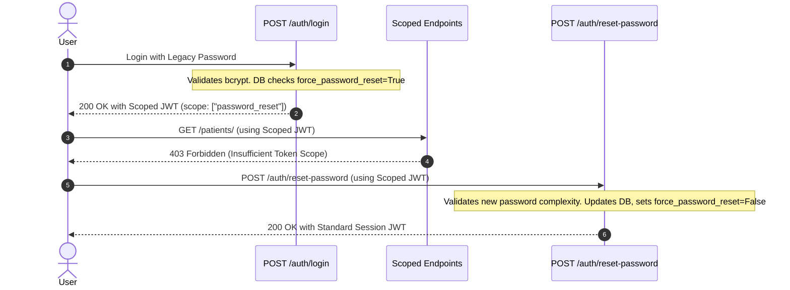

# Day 36A Security Roadmap

This document outlines the architecture, data flows, and design specifications for the Day 36A Authentication Security Hardening phase, building upon the findings from the preceding security audits.

---

## 1. Password Policy Design

To ensure robust credentials, we design a strict, fail-fast password complexity enforcement policy.

### Core Policy Rules
* **Minimum Length**: 12 characters (aligned with modern NIST guidelines).
* **Complexity Requirements**:
  * At least 1 uppercase letter (`A-Z`).
  * At least 1 lowercase letter (`a-z`).
  * At least 1 numeric digit (`0-9`).
  * At least 1 special character (from the set `@$!%*?&`).
* **Entropy Check**: Prohibit common/sequential password patterns (e.g., `"12345678"`, `"password123"`).

### Validation Location
* **Primary (Fail-Fast)**: Pydantic request models (`UserRegisterRequest`, `ResetPasswordRequest`) via a custom regex validator. This blocks invalid inputs at the API gateway before executing expensive bcrypt hashing operations.
* **Secondary**: Service layer checks in [auth_utils.py](file:///c:/Users/Manish/AI-Projects/neuroscribe/backend/auth_utils.py) as a fallback mechanism.

### User-Facing Error Responses
When validation fails, return a `422 Unprocessable Entity` containing a clear, structural message:
```json
{
  "detail": [
    {
      "loc": ["body", "password"],
      "msg": "Password must be at least 12 characters long and include at least one uppercase letter, one lowercase letter, one digit, and one special character.",
      "type": "value_error"
    }
  ]
}
```

---

## 2. Password Reset Lifecycle & Enforcement

Legacy users backfilled into the system require forced password updates upon initial interaction. We design a secure, scoped credentials transition flow.



### Lifecycle Implementation Steps
1. **Scoped Token Generation**:
   * If a user logs in successfully but `user.force_password_reset` is `True`, [auth.py](file:///c:/Users/Manish/AI-Projects/neuroscribe/backend/routers/auth.py) issues a short-lived (5-minute) token containing a restricted scope claim:
     ```json
     {
       "sub": "user_id",
       "scope": "password_reset",
       "exp": 1717325600
     }
     ```
2. **Access Control Gating**:
   * Update `get_current_user` in [auth_utils.py](file:///c:/Users/Manish/AI-Projects/neuroscribe/backend/auth_utils.py) to check the JWT scopes.
   * If a token contains `scope="password_reset"`, reject all standard API calls with `403 Forbidden` (`PASSWORD_RESET_REQUIRED`).
3. **Reset Password Endpoint**:
   * Expose `POST /auth/reset-password`. It requires the restricted scope token and accepts `{"new_password": "..."}`.
   * The handler updates the password, resets `force_password_reset = False`, commits the changes, and returns a standard full-session JWT.

---

## 3. Authentication Rate Limiting

To prevent automated credential stuffing and brute-force attacks, we design a client rate-limiting layer.

### Framework Choice
* **Recommended Library**: `slowapi` (a FastAPI port of `limits`).
* **Backend Storage**: Memory backend for local development, migrating to a Redis cluster in production for shared state.

### Endpoint Limits
* **`POST /auth/login`**: Max **5 requests per minute** per client IP address.
* **`POST /auth/register`**: Max **3 requests per hour** per client IP address.
* **Failure Responses**: Return a `429 Too Many Requests` status code with a custom header:
  ```http
  HTTP/1.1 429 Too Many Requests
  Retry-After: 60
  ```

---

## 4. Failed Login Tracking & Account Lockout

A database-backed account lockout mechanism protects clinician credentials when attackers attempt low-and-slow brute-force runs.

### Database Schema Requirements (Future Migration)
To track lockout state, the `users` table requires the following nullable fields:
```python
# In models.py (Draft Schema Additions)
failed_login_attempts = Column(Integer, default=0, nullable=False)
lockout_until = Column(DateTime(timezone=True), nullable=True)
```

### Lockout Algorithm
1. **Failure Trigger**: Each failed password validation increments `failed_login_attempts`.
2. **Lockout Trigger**: Upon reaching **5 consecutive failed attempts**, set `lockout_until` to `NOW() + 15 minutes`.
3. **Login Check**: During authentication:
   * If `lockout_until` is present and in the future, reject the request immediately with `403 Forbidden` (`ACCOUNT_LOCKED`).
4. **Successful Login**: Reset both columns (`failed_login_attempts = 0`, `lockout_until = None`).
5. **Unlock Strategy**: Lockout expires automatically after 15 minutes. Alternatively, allow administrative resets via the system console.

---

## 5. Security Event Logging Specifications

We design a structured, machine-readable JSON logging architecture. These logs are directed to `stderr` to be ingested by security information and event management (SIEM) systems.

### Core Event Structs
* **`USER_CREATED`**: Logged when a user successfully registers. Includes IP address, user agent, and new user UUID.
* **`LOGIN_SUCCESS`**: Logged when a clinician successfully logs in and receives a token.
* **`LOGIN_FAILURE`**: Logged on credential mismatch or user-not-found. Includes the target email and failure reason (e.g. `invalid_credentials` vs `account_locked`).
* **`PASSWORD_RESET`**: Logged when the legacy `force_password_reset` workflow completes.
* **`PASSWORD_CHANGED`**: Logged when an active user changes their password from the account settings page.
* **`TOKEN_REJECTED`**: Logged in `get_current_user` if a request uses an expired, malformed, or signature-invalid token.

---

## 6. Risk Analysis & Implementation Roadmap

We evaluate implementation priorities based on security yield vs development complexity:

| Sequence | Task Description | Security Gain | Complexity | Recommendation |
| :--- | :--- | :--- | :--- | :--- |
| **1** | **Password Complexity Guard** | High | Low | **Critical First Step**: Prevents weak passwords at register/reset. |
| **2** | **Route Rate Limiting** | High | Low | **High Priority**: Protects endpoints from raw script brute-forcing. |
| **3** | **Password Reset Lifecycle** | High | Medium | **High Priority**: Closes legacy credential exposure window. |
| **4** | **Failed Login Lockout** | Medium | Medium | **Medium Priority**: Defends against low-and-slow brute forcing. |
| **5** | **Security Event Logging** | Medium | Low | **Medium Priority**: Enables compliance and security observability. |

---

## 7. Verification Plan

Prior to releasing Day 36A changes, the following checks must pass:

### Automated Tests
1. **Regex Integration Verification**: Submit register payloads with 7-character, numeric-only, and symbol-less passwords; confirm all are rejected with `422 Unprocessable Entity`.
2. **Reset Workflow Isolation**: Login as a backfilled legacy user. Attempt a request to `GET /patients` using the issued token. Confirm it returns `403 Forbidden`. Then, call `/auth/reset-password` and verify standard access is restored.
3. **Throttling Verification**: Launch a benchmark script triggering 10 login attempts in under 5 seconds. Confirm that attempts 6 through 10 receive `429 Too Many Requests`.

### Manual Audit Checks
* Inspect logs to ensure no plaintext passwords or session tokens are ever written to standard outputs.
