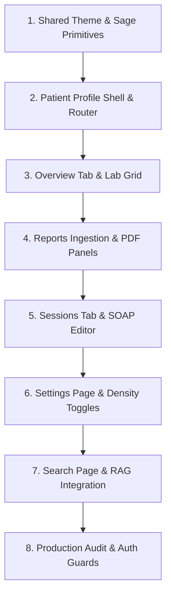

# Stitch UI Integration Plan — NeuroScribe Frontend

This document establishes the official **Stitch UI Integration Plan** for the NeuroScribe frontend. It aligns the Vite-React single-page application (SPA) codebase with the approved high-fidelity visual assets ("Stitch screens"), mapping functionality defined in `frontend_architecture.md` against live backend endpoints and establishing a clear path to product delivery.

---

## 1. Screen Inventory

Below is the inventory of all approved Stitch screens, their corresponding React pages, route structures, and required backend endpoints:

| Screen Name | React Page Component | Route Path | Required Backend API Endpoints |
|---|---|---|---|
| **Login Page** | `LoginPage.tsx` | `/login` | `POST /auth/login` *(Planned)*<br>`GET /auth/me` *(Planned)* |
| **Clinical Dashboard** | `DashboardPage.tsx` | `/` | `GET /patients/`<br>`GET /patient-overview/{id}` |
| **Patient Directory** | `PatientDirectoryPage.tsx` | `/patients` | `GET /patients/` |
| **Patient Profile (Overview)** | `PatientProfilePage.tsx`<br>↳ `OverviewTab.tsx` | `/patients/:patientId/overview` | `GET /patients/{id}`<br>`GET /patient-overview/{patientId}` |
| **Patient Profile (Reports)** | `PatientProfilePage.tsx`<br>↳ `ReportsTab.tsx` | `/patients/:patientId/reports` | `GET /reports/patient/{id}`<br>`POST /reports/upload`<br>`POST /reports/{id}/ocr`<br>`GET /reports/{id}` |
| **Patient Profile (Trends/Timeline)**| `PatientProfilePage.tsx`<br>↳ `TimelineTab.tsx` | `/patients/:patientId/timeline` | `GET /timeline/{id}`<br>`GET /compare/{id}` |
| **Sessions / Consultations** | `SessionsTab.tsx`<br>↳ `SessionDetailPage.tsx` | `/patients/:patientId/sessions`<br>`/patients/:patientId/sessions/:sessionId` | `GET /sessions/patient/{id}`<br>`POST /sessions/`<br>`GET /sessions/{id}`<br>`POST /upload-audio`<br>`POST /generate-note`<br>`POST /save-note` |
| **Settings Panel** | `SettingsPage.tsx` | `/settings` | Static local persistence *(Future Backend API)* |
| **Semantic Search Hub** | `SearchPage.tsx` | `/search` | `POST /ask/` *(no cache)* |

---

## 2. UI Mapping Matrix

To maintain the architectural standard of **dry, decoupled components**, this matrix identifies which UI primitives are reused, which new ones are required, and which common layers must be extracted:

### 2.1 Reusable Existing Components (from Days 25–27)
* **`PageShell.tsx` / `Sidebar.tsx` / `TopBar.tsx`:** Standard framework layouts with responsive constraints.
* **`StatusBadge.tsx`:** Maps `'STABLE' | 'WARNING' | 'CRITICAL'` (and the visual equivalents `Stable`, `Monitor`, `Attention Required` / `Critical`) to the corresponding theme badges with blinking pulsing indicator dots.
* **`Spinner.tsx` / `EmptyState.tsx` / `ErrorBoundary.tsx`:** Generic UI utilities.

### 2.2 New Components Required
* **`ExtractedLabsTable.tsx` (Features/Patients/Components):** A tabular list rendering lab test name, numeric result, out-of-range warnings, standard reference boundaries, and trend arrows.
* **`ClinicalTrendsSnapshot.tsx` (Features/Patients/Components):** 3-column quick snapshot dashboard mapping Hemoglobin, WBC, and Platelets status boxes.
* **`AiInsightsCard.tsx` (Features/Patients/Components):** Renders AI clinical summaries, confidence indicators, key findings with custom icons, and bulleted recommendation cards.
* **`ActivityTimeline.tsx` (Features/Patients/Components):** Vertical activity list rendering events with pulsing colored dots and descriptive subtexts.
* **`AudioWaveRecorder.tsx` (Features/Sessions/Components):** Renders dynamic audio waveforms, timer states, and interactive play/pause controls.
* **`ChatTranscript.tsx` (Features/Sessions/Components):** Dual-sender chat bubbles mapping dialogs between doctor and patient with full scroll constraints.
* **`SoapDraftEditor.tsx` (Features/Notes/Components):** Multi-tab text editor splitting Subjective, Objective, Assessment, and Plan fields with inline AI feedback.
* **`PdfViewerPanel.tsx` (Features/Reports/Components):** Centered panel displaying uploaded PDF files alongside active OCR status timelines.
* **`OcrTimelineStatus.tsx` (Features/Reports/Components):** Pipeline tracking layout tracing ingestion steps.

### 2.3 Shared Primitives to Extract
* **`SageButton.tsx`:** Sage green button (`bg-[#508a7b] text-white hover:bg-[#437568]`) styled exactly as seen in the Stitch mockups.
* **`LucideSparklesIcon` / `SparklesBadge`:** Reusable Sage AI Sparkles badge indicating "AI GENERATED" or "HIGH CONFIDENCE".
* **`TimelineTrack.tsx`:** Reusable track with colored dot nodes for activity streams and pipelines.

---

## 3. Gap Analysis

Comparing the current **Days 25–27 implementation** against the **Stitch designs** and the baseline **`frontend_architecture.md`**, we identify the following gaps:

### 3.1 Missing UI Sections & Screens
* **Settings Page (`/settings`):** Toggles for appearance density, password updating modules, and AI configuration switches are completely missing.
* **Sessions Panel & Editor (`/patients/:id/sessions/:sid`):** The wave recorder, live chat bubbles, and structured SOAP tab panels do not exist yet.
* **Reports PDF Ingestion & Extracted Values Table:** The 3-column reports workspace showing PDF panels, OCR checklists, and extracted results tables is missing.

### 3.2 Missing Backend Integrations & Mismatches
* **Dashboard Stats Cards:** The main Dashboard currently renders static stats cards for finalised sessions (14) and processed reports (8). These metrics should eventually be bound to dynamic backend queries or clearly cataloged as static placeholders until the database aggregates them.
* **Settings Switches:** Frontend has no state backing for Layout Density or AI Engine Toggles. Local storage fallbacks must be established.
* **Interactive Chat Transcripts & Notes Editor:** No socket connections or post requests are wired to bind audio streams to live text feeds.

### 3.3 Visual Mismatches
* **Sidebar Layout:** The mockups showcase a distinct **"+ New Consultation"** Sage green button at the bottom of the sidebar. The current sidebar has standard text navigation buttons.
* **Theme Styling:** The mockups depict an incredibly clean, high-contrast **light mode layout** with soft Sage green buttons and borders, alongside a separate high-contrast **dark mode layout**. The current Vite scaffold supports class-based dark mode, but the accent colors must be aligned with the Sage theme tokens (`#508a7b`) to match the assets.

---

## 4. Day-by-Day Execution Roadmap

Here is the proposed 5-day delivery roadmap to achieve complete Stitch UI parity:

```mermaid
gantt
    title NeuroScribe Frontend Execution Timeline
    dateFormat  YYYY-MM-DD
    section Implementation
    Day 28 : Patient Profile Frame & Overview Tab   :crit, active, 2026-06-03, 1d
    Day 29 : Sessions Panel & Wave Transcription   :2026-06-04, 1d
    Day 30 : Reports Workspace & PDF Ingestion     :2026-06-05, 1d
    Day 31 : Settings Dashboard & Theme Toggles   :2026-06-06, 1d
    Day 32+: Search Hub & Production Hardening      :2026-06-07, 2d
```

### Day 28: Patient Profile & Overview Tab
* **Target Screen:** Patient Profile Overview Tab (`/patients/:patientId/overview`)
* **Components:** `PatientProfilePage.tsx`, `OverviewTab.tsx`, `AiInsightsCard.tsx`, `ClinicalTrendsSnapshot.tsx`, `ActivityTimeline.tsx`, `ExtractedLabsTable.tsx`
* **APIs:** `GET /patients/{id}`, `GET /patient-overview/{id}`
* **Verification:** TypeScript compiles cleanly. Radhika Erra's record displays exact out-of-range lab metrics in red, matching her actual clinical status (`CRITICAL`).

### Day 29: Sessions Panel & Wave Transcription
* **Target Screen:** Sessions Tab & Session Detail Page (`/patients/:id/sessions/:sid`)
* **Components:** `SessionsTab.tsx`, `AudioWaveRecorder.tsx`, `ChatTranscript.tsx`, `SoapDraftEditor.tsx`
* **APIs:** `GET /sessions/patient/{id}`, `POST /sessions/`, `POST /upload-audio`, `POST /generate-note`
* **Verification:** Successful simulation of transcription text loading. Waveform starts and stops with sound input, and SOAP forms are editable.

### Day 30: Reports Panel & OCR PDF Ingest
* **Target Screen:** Reports Tab (`/patients/:patientId/reports`)
* **Components:** `ReportsTab.tsx`, `PdfViewerPanel.tsx`, `OcrTimelineStatus.tsx`
* **APIs:** `GET /reports/patient/{id}`, `POST /reports/upload`, `POST /reports/{id}/ocr`
* **Verification:** Drag-and-drop report uploads function. OCR timelines display checks as processing milestones complete, rendering extracted values in a clean table.

### Day 31: Settings Panel & Appearance Switches
* **Target Screen:** Settings Dashboard (`/settings`)
* **Components:** `SettingsPage.tsx`, switches for density (Standard vs. Compact), themes (Light/Dark/System), and AI configuration toggles.
* **APIs:** State managed via `AppContext.tsx` persisted to `localStorage`.
* **Verification:** Toggling Compact density compresses sidebar and table heights instantly. Dark/Light switch updates `<html>` elements cleanly.

### Day 32+: Semantic Search & Production Build
* **Target Screen:** Semantic Search Page (`/search`), Global error testing.
* **Components:** `SearchPage.tsx`, Error boundary fallbacks, Toaster configurations.
* **APIs:** `POST /ask/` (RAG semantic retrieval).
* **Verification:** Full-coverage audit using `npm run build` producing zero warnings. Full auth-flow tests run cleanly.

---

## 5. Technical Debt Register

| Code/Architecture Debt Item | Context & Current Impact | Future Requirement / Resolution |
|---|---|---|
| **Deterministic Status Hashing** | StatusBadge values are calculated client-side via name hashing overrides in `PatientCard.tsx` because the listing API does not return clinical status. | Update backend `GET /patients/` to return aggregated status (`clinical_status`, `clinical_flags`, `latest_labs`) and bind the badge directly to the payload. |
| **Blood Group Placeholder** | The patient profile header renders a hardcoded blood type `"Blood A+"` client-side because the patient entity does not have a database field. | Expose a `blood_group` column in the backend database model, schema validation, and `GET /patients/{id}` response payload to dynamically bind it in `PatientProfilePage.tsx`. |
| **Static Dashboard Metrics** | Dashboard metrics cards (Total Patients, Processed Reports) currently display stub values (`14`, `8`) to match basic guidelines. | Bind processed reports and session numbers to real backend COUNT aggregation queries. |
| **Settings Config State** | Settings switches (specialty ID, AI engine switches) are saved locally to `localStorage` and lack persistent backend schema bindings. | Add a `/user/settings` backend table and endpoints to sync preferences across sessions. |
| **Bypassed Auth Guards** | Development env relies on `VITE_AUTH_ENABLED=false` to bypass guards since the FastAPI backend does not yet expose live JWT login routines. | Deploy planned auth routes (`/auth/login`, `/auth/me`) and wire standard Bearer headers to the Axios transport client. |

---

## 6. Final Recommended Build Order

To deliver the remaining screens with **maximum speed, absolute code reuse, and zero regression risk**, we recommend the following build order:



### Dependency Logic for the Build Order:
1. **Shared Theme & sage Primitives first:** Ensures Sage buttons, Sparkle badges, and standard colors are established so no component overrides are duplicated.
2. **Patient Profile shell before tabs:** The horizontal navigation tab header and nested `<Outlet />` must be stable before building any sub-tab (Overview, Sessions, Reports, Trends).
3. **Overview tab before Reports/Sessions:** Resolving the simpler, read-only Overview tab validates query performance first before handling complex file uploads (Reports) and wave transcriptions (Sessions).
4. **Reports before Sessions:** Reports tab contains the basic PDF rendering blocks and extraction models that lay the groundwork for structured SOAP drafting in the sessions tab.
5. **Settings & Search last:** These are peripheral features that do not block core patient clinical workflows.
